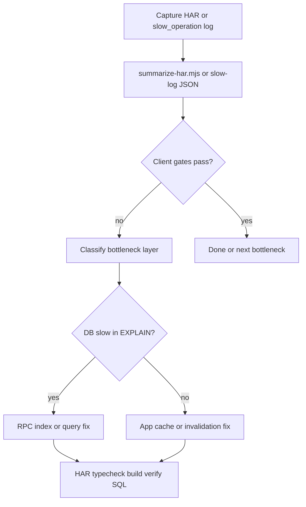

# Bauflip Performance Engineering

## When to apply

Use this skill for Bauflip 2.0 performance work:

- HAR analysis or regression after deploy
- Slow page, POST storm, or high Netlify function duration
- `slow_operation` JSON in function logs
- Hybrid-SSR / dehydration / TanStack cache issues
- Supabase RPC, index, or migration design
- Interaction sessions (Termin buchen, Auftrag rapport+photos)
- Continuing refactoring PR-H+

**Living baseline (German metrics):** [`docs/performance-production-har.md`](../../../docs/performance-production-har.md)  
**How-to playbook (this skill):** English reference files below.

---

## Golden rules

1. **Measure first** — `node scripts/perf/summarize-har.mjs <file.har>` before and after; no perf claims without gates.
2. **Office web is system of record** — optimize server round-trips, not paint alone.
3. **Patch over refetch** — attachments, notes, uploads return known deltas; use `patchAttachment*` in [`lib/query/invalidations.ts`](../../../lib/query/invalidations.ts).
4. **Scoped invalidation** — when appointment window is known, use `invalidateAppointmentRangeCaches`; avoid `weekTasks.all()` / `availabilityRange.all()` (PR-G).
5. **Security unchanged** — never skip server access checks to save a query (PR-E still verifies on server).
6. **DB migrations need explicit user approval** — document patterns; do not auto-apply SQL.
7. **RPC + fallback** — every new RPC in [`lib/db/repository.ts`](../../../lib/db/repository.ts) keeps a PostgREST fallback (see calendar range).
8. **Simplicity first** — smallest diff that moves a HAR gate; defer Tier-2 items (`availability_range_for_org`, Redis) until proven pain.
9. **Tier 1 active** — `project_core_bootstrap` RPC (PR-I) is the top sheet-open lever; see [massive-perf-roadmap.md](./massive-perf-roadmap.md).
10. **Postgres practices** — read [supabase-postgres-best-practices](../supabase-postgres-best-practices/SKILL.md) when writing SQL.
11. **Update this skill** — after every perf phase, sync `.agents/` and `.cursor/skills/bauflip-performance/` mirrors.

---

## Standard workflow

After code changes: `npm run typecheck` and `npm run build`. For DB: run matching `scripts/perf/verify-*.sql`.

---

## Interaction gates (quick reference)

| Route / session | Metric | Target |
|-----------------|--------|--------|
| `/projekte` first load (Hybrid-SSR) | Bootstrap POST | **0×** |
| `/projekte` (client-only path) | POST after document | **1×** bootstrap |
| Termin buchen session | POST `/projekte` total | **≤ 8** |
| Termin buchen | `availability` POSTs | **≤ 3** |
| `/auftrag` load | POST after document | **1×** extras, **0×** core refetch |
| Auftrag rapport+photos | POST `/auftrag` | **≤ 4**, **0×** `fetchAuftragProjectCoreAction` |
| `/tag` load | POST after document | **0×** |
| `/kalender` load | POST within 500ms of document | **0×** (hydration regression) |
| Sheet open (PR-I) | `core` POSTs | **1×** (`getProjectSheetBootstrapAction`) |
| Prefetch noise | early `_rsc` GETs | **0** (see tag/kalender checklists) |

Capture: [`scripts/perf/projekte-interaction-checklist.md`](../../../scripts/perf/projekte-interaction-checklist.md)  
Summarize: `node scripts/perf/summarize-har.mjs ~/path/file.har`  
Local host: `BAUFLIP_HAR_HOST=localhost node scripts/perf/summarize-har.mjs ~/localhost.har`

---

## Architecture cheat sheet

| Layer | Location | Notes |
|-------|----------|-------|
| Edge auth | [`proxy.ts`](../../../proxy.ts) | Fast-path without cookie; proxy headers `x-bauflip-proxy-*` |
| Session | [`lib/auth/session.ts`](../../../lib/auth/session.ts) | `getLayoutSession` in layouts; `getCurrentSession` only where profile write needed |
| SSR bootstrap | `lib/*/server-bootstrap.ts` | `build*DehydratedState` per route |
| Hydration | [`components/app/query-hydration-boundary.tsx`](../../../components/app/query-hydration-boundary.tsx) | Single shared boundary (PR-B) |
| Queries | [`lib/query/hooks.ts`](../../../lib/query/hooks.ts) | Infinite list, week tasks, auftrag core |
| Cache | [`lib/query/invalidations.ts`](../../../lib/query/invalidations.ts) | patch*, scoped invalidation |
| Realtime | [`lib/query/realtime-bridge.tsx`](../../../lib/query/realtime-bridge.tsx) | Supabase broadcast — **no** `/api/events` |
| DB | [`lib/db/repository.ts`](../../../lib/db/repository.ts) | RPC first when ≥2 round-trips |
| Slow ops | [`lib/observability/slow-log.ts`](../../../lib/observability/slow-log.ts) | `SERVER_ACTION_SLOW_MS=800` |

---

## Shipped performance RPCs (index)

| RPC | Migration |
|-----|-----------|
| `next_appointment_starts_for_org` | `20260622140000_perf_next_appointment_rpc.sql` |
| `project_status_counts_for_org` + trgm indexes | `20260622190000_perf_status_counts_search_trgm.sql` |
| `projekte_office_bootstrap` | `20260626120000_perf_projekte_office_bootstrap_rpc.sql` |
| `calendar_range_tasks_for_org` | `20260626200000_perf_calendar_range_rpc.sql` |
| `mitarbeiter_office_bootstrap` | `20260627120000_perf_mitarbeiter_bootstrap_rpc.sql` |
| `project_core_bootstrap` | `20260701120000_perf_project_core_bootstrap_rpc.sql` (PR-I) |

Detail: [supabase-database.md](./supabase-database.md)

---

## Next massive wins

| Tier | Doc |
|------|-----|
| Tier 1 (sheet RPC + cold start) | [massive-perf-roadmap.md](./massive-perf-roadmap.md) |
| Tier 2 (year view, ABGEMACHT, availability RPC) | same |

---

## Refactoring PRs (status)

| PR | Done | Summary |
|----|------|---------|
| A | yes | Dead exports removed |
| B | yes | `QueryHydrationBoundary` |
| C | yes | `mapRole`, `hasSupabaseAuthCookie` |
| D | yes | `getFilledOrderFormFields` |
| E | yes | Auftrag extras without full `getProjectCore` |
| F | yes | Monteur mutations via hooks |
| G | yes | Range-scoped calendar invalidation |
| H | planned | Bootstrap + infinite page-1 dedupe |
| I | yes (code) | `project_core_bootstrap` + single sheet action — **apply migration** |

Detail: [refactoring-pr-roadmap.md](./refactoring-pr-roadmap.md)

---

## Progressive disclosure

Read only what the task needs:

| File | Use when |
|------|----------|
| [performance-chronology.md](./performance-chronology.md) | Full phased timeline; what shipped when |
| [har-measurement.md](./har-measurement.md) | HAR capture, summarize-har, per-route gates |
| [netlify-auth-compute.md](./netlify-auth-compute.md) | Proxy, session dedupe, Realtime, slow logs |
| [ssr-hydration-bootstrap.md](./ssr-hydration-bootstrap.md) | Hybrid SSR per route, timezone keys |
| [tanstack-cache-invalidation.md](./tanstack-cache-invalidation.md) | primeCore, patch vs invalidate |
| [interaction-playbook.md](./interaction-playbook.md) | Termin buchen, Auftrag, prefetch fixes |
| [supabase-database.md](./supabase-database.md) | RPCs, indexes, migrations, EXPLAIN |
| [refactoring-pr-roadmap.md](./refactoring-pr-roadmap.md) | PR A–H files and verification |
| [related-domain.md](./related-domain.md) | Status/attachment fixes affecting gates |
| [massive-perf-roadmap.md](./massive-perf-roadmap.md) | Tier 1–3 massive perf options |

---

## Measurement pitfalls

- **Browser extensions** — DevTools showing ~118 requests / 6 MB is often `chrome-extension://`, not Bauflip. Use Incognito or filter `gross-storenbau`.
- **Cold start** — see cold start checklist in [`docs/netlify-compute-optimization.md`](../../../docs/netlify-compute-optimization.md); optional warmup ping
- **Failed to find Server Action** — deploy mismatch; hard reload after deploy.
- **Capture after redirect** — HAR without document GET uses first POST as timeline anchor.

---

## Ops checklist (one-time / deploy)

1. `npx tsx --env-file=.env.local scripts/sync-user-auth-metadata.mts` — backfill `user_metadata.organization_id`
2. Apply RPC migrations before relying on code paths (`npm run db:push` with user approval)
3. Netlify env: `SERVER_ACTION_SLOW_MS=800`
4. Verify: no `/api/events` in observability after Realtime migration
5. Cold start: region + pooler — see [`docs/netlify-compute-optimization.md`](../../../docs/netlify-compute-optimization.md) cold start checklist

---

## Related docs

- [`docs/netlify-compute-optimization.md`](../../../docs/netlify-compute-optimization.md)
- [`docs/phase-2b-list-slim.md`](../../../docs/phase-2b-list-slim.md)
- [`docs/archive/DOWNSIZING-RESULTS.md`](../../../docs/archive/DOWNSIZING-RESULTS.md)
- [`scripts/perf/`](../../../scripts/perf/) — checklists, verify SQL, `summarize-har.mjs`
