# Performance chronology

Master timeline for Bauflip 2.0 performance work. Metrics live in [`docs/performance-production-har.md`](../../../docs/performance-production-har.md).

## Timeline overview

```mermaid
flowchart LR
  subgraph foundations [Foundations]
    downsize[Downsizing]
    prio[Prio 1-7]
  end
  subgraph netlify [Netlify]
    phaseA[Phase A Proxy]
    phaseB[Phase B Client-first]
    phaseC[Phase C Session]
    realtime[Realtime migration]
  end
  subgraph projekte [Projekte arc]
    p1[Phase 1 Hybrid-SSR]
    p2a[2a active filter]
    p2c[2c pagination]
    p2b[2b slim rows]
    p2d[2d counts trgm]
    p2e[2e bootstrap RPC]
  end
  subgraph kal [Kalender]
    kalSSR[Hybrid-SSR]
    kalTZ[Zurich key fix]
    kalInt[interaction fixes]
    kalDB[Kal-DB RPC]
  end
  subgraph routes [Other routes]
    mit[Mitarbeiter]
    est[Einstellungen]
    bf[Bestellformulare]
    tag[Tag]
    wp[Wochenplan]
    auf[Auftrag defer]
  end
  subgraph interaction [Interaction]
    intHAR[Termin buchen gates]
    prs[PR A-G]
  end
  foundations --> netlify --> projekte
  netlify --> kal --> routes --> interaction
```



---

## Phase table

| Phase | When / trigger | Goal | Key outcome |
|-------|----------------|------|-------------|
| **Downsizing** | Pre-perf | Smaller app, leaner DB | Fewer tables/columns; see `docs/archive/DOWNSIZING-RESULTS.md` |
| **Prio 1** | Auth audit | Dedupe `getUser` | `proxy.ts` + `getLayoutSession` |
| **Prio 2–7** | Safe wins | List cap 2000, single appointment query, lighter refetch, team emails, tech redirect, slow-log env | `.env.example` `SERVER_ACTION_SLOW_MS` |
| **Phase A** | Netlify compute | Less proxy work | Public fast-path; proxy headers; client branding |
| **Phase B** | Netlify compute | Client-data-first pages | Later **superseded** by Hybrid-SSR on key routes |
| **Phase C** | Netlify compute | Session profile once | `requireOfficeSession`; no profile POST on tag/wochenplan; metadata fast-path |
| **Realtime** | 60s SSE functions | Remove `/api/events` | Supabase broadcast; `lib/realtime/publish.ts` |
| **Deep dive HAR** | localhost `/projekte` | Diagnose waterfall | 3 POSTs + duplicate session → bundling roadmap |
| **Phase 1** | `/projekte` | Hybrid-SSR | **0** bootstrap POST on first load |
| **Phase 2a** | `/projekte` | Default `active`; defer next-appointment RPC | Smaller payload; URL-stable filters |
| **Phase 2c** | `/projekte` | Pagination 50 + `?q=` search | RSC ~50–80 KB; infinite «Weitere laden» |
| **Phase 2b** | `/projekte` | Slim list rows | No address columns in list payload |
| **Phase 2d** | `/projekte` | Status counts RPC + trgm | No full-table status scan |
| **Phase 2e** | `/projekte` | `projekte_office_bootstrap` RPC | 1 DB roundtrip for page 1 + counts |
| **Phase Kal** | `/kalender` | Hybrid-SSR range tasks | Data at document end (~953 ms prod) |
| **Kal TZ fix** | Hydration miss | Zurich wall-clock keys | Eliminates redundant POST after SSR |
| **Kal interaction** | HAR clicks | No RSC storms | `replaceState`; `prefetch={false}`; lazy sheet |
| **Kal-DB** | slow `weekTasks` | `calendar_range_tasks_for_org` | 2 DB calls → 1 |
| **Phase Mit** | `/mitarbeiter` | Hybrid-SSR + RPC | 3 POST → 0 POST |
| **Phase Est** | `/einstellungen` | Hybrid-SSR | 1–2 POST → 0 POST |
| **Phase BF** | `/bestellformulare` | Hybrid-SSR + setQueryData | 1 POST load; 1 POST per mutation |
| **Phase Tag** | `/tag` | Hybrid-SSR week tasks | 0 POST after load |
| **Phase Wochenplan** | `/wochenplan` | Week SSR; month defer | Month POST only when needed |
| **Phase Auftrag** | `/auftrag/[id]` | Defer extras | Faster TTFB; 1 extras POST |
| **Phase Interaction** | 3-min session | POST budgets | ≤8 / ≤3 / ≤4 gates |
| **PR A–G** | Refactor cleanup | Maintainability + fewer refetches | User verified locally |
| **PR H** | Planned | Dedupe bootstrap + page-1 | Medium risk |

---

## `/projekte` metric progression (warm prod, documented)

| Phase | Bootstrap POST | Data ready (approx) | Notes |
|-------|----------------|---------------------|-------|
| Pre-optimization | 3× | ~2+ s | Dev HAR |
| Phase C | 1× | ~1.8 s | Single bootstrap |
| Phase 1 Hybrid-SSR | 0× | ~document end | ~1.3 s doc |
| Phase 2c | 0× | ~783 ms | 50 rows, 17 KB wire |
| Phase 2e target | 0× | ~730–780 ms | Fewer DB roundtrips |

---

## Kalender metric progression

| State | Data ready | Notes |
|-------|------------|-------|
| Before Hybrid-SSR | ~1917 ms | POST after hydration + prefetch storm |
| After Hybrid-SSR + TZ fix | ~953 ms | 0 POST, 9 appointments in RSC |
| After Kal-DB | TTFB target ~280–350 ms | `weekTasks` 500–700 ms in logs |

---

## What superseded what

| Old approach | Replaced by |
|--------------|-------------|
| 3× POST on `/projekte` load | Hybrid-SSR + single bootstrap (then 0 POST) |
| Branding POST separate | In bootstrap, then layout SSR (2e) |
| `/api/events` SSE 60s functions | Supabase Realtime broadcast |
| `getCurrentSession` in every mutation | `requireOfficeSession` / layout session |
| `router.replace` on kalender day change | `history.replaceState` |
| Full `getProjectCore` in auftrag extras | Head + attachments only (PR-E) |
| `afterAttachmentChange` for notes/delete | `patchAttachment*` (interaction + PR-F) |
| Broad `weekTasks.all()` after appointment | `invalidateAppointmentRangeCaches` (PR-G) |
| Sheet head → details waterfall (2 POST) | `getProjectSheetBootstrapAction` + `project_core_bootstrap` RPC (PR-I) |

---

## User verification milestones (chat)

- «alles funktioniert bis PR E» — A through E verified
- Later through **PR-G** — typecheck + build green after each PR
- Kalender interaction HAR — gates PASS (0 early POST, sheet on `/kalender`)

---

## Backlog (not shipped)

| Item | Why deferred |
|------|--------------|
| PR-H | Bootstrap + infinite page-1 dedupe; SSR sync risk |
| `availability_range_for_org` | Booking interaction; needs approval |
| Abgemacht DB pagination | 500-row in-memory page |
| Kalender year view slim | 132 KB / ~1.1 s per switch |
| Prod HAR re-capture (PR-I sheet) | After `db:push` + deploy |

---

## One-time ops

```bash
npx tsx --env-file=.env.local scripts/sync-user-auth-metadata.mts
psql "$DATABASE_URL" -f scripts/perf/verify-projekte-bootstrap-rpc.sql
# ... other verify-*.sql per migration
```

Apply migrations with **explicit user approval** before production relies on RPC paths.
