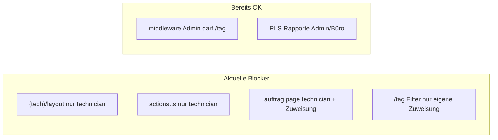

# Admin/Büro: Einsatz- und Rapport-Zugang (eigener Account)

## Ausgangslage

- **[`middleware.ts`](middleware.ts)** schränkt nur **Monteure** ein (Whitelist von Pfaden). **Admin/Büro** dürfen URL-seitig alle Routen aufrufen — `/tag` ist nicht blockiert.
- **[`app/(tech)/layout.tsx`](app/(tech)/layout.tsx)** ist der harte Blocker: `session.role !== "technician"` → Redirect auf `/`. Dadurch erreichen Admin/Büro **`/tag` nie**, obwohl die URL technisch erlaubt wäre.
- **[`app/(tech)/auftrag/[projectId]/page.tsx`](app/(tech)/auftrag/[projectId]/page.tsx)** verlangt `technician` **und** Zuweisung (`assignedTechnicianId` oder `nextOwnerUserId`). Ein Admin vor Ort ohne diese Zuweisung landet bei `notFound()` — ungeeignet für Bestandesaufnahme beim ersten Termin.
- **[`app/(tech)/actions.ts`](app/(tech)/actions.ts)** (`submitTechnicianReportAction`) erlaubt nur `technician`, obwohl **RLS** `technician_reports` für `office`/`admin`/`technician` schreibbar lässt ([`technician_reports_write` in init-Migration](supabase/migrations/20260322100000_init_bauflip_mvp.sql)).
- **[`app/(tech)/tag/page.tsx`](app/(tech)/tag/page.tsx)** filtert alle Listen strikt auf `assignedTechnicianId === session.user.id`. Für Admin/Büro wäre die Seite sonst fast immer leer, obwohl `listWeekTasks` über RLS bereits die **organisationsweiten** Termine liefert.

## Gewünschte Regeln (vereinbart)

- **Admin und Büro** (nicht Monteur-Account): gleicher Funktionsumfang auf den **Einsatz-Routen** unter `(tech)`.
- **Identität**: Rapport wird weiter über `created_by` / Session-User gespeichert — **kein** gemeinsamer Monteur-Login nötig.

## Umsetzung

### 1. Zentrale Berechtigungsabfrage

- Kleine Hilfsfunktion z. B. `canAccessTechFieldRoutes(role)` oder `isFieldWorkerRole(role)` in [`lib/auth/session.ts`](lib/auth/session.ts) oder [`lib/domain/types.ts`](lib/domain/types.ts): `technician | admin | office`.
- Verwendung in Layout, Pages und Actions statt mehrfacher `!== "technician"`-Logik.

### 2. [`app/(tech)/layout.tsx`](app/(tech)/layout.tsx)

- Statt nur `technician` **alle drei Rollen** zulassen (Monteur-UI mit Bottom-Nav bleibt für alle drei).

### 3. [`app/(tech)/tag/page.tsx`](app/(tech)/tag/page.tsx)

- **Monteur**: Verhalten unverändert (nur eigene Zuweisungen).
- **Admin/Büro**:
  - `todaysTasks` / `upcomingTasks`: **alle** Termine aus `listWeekTasks`, die RLS ohnehin auf die Organisation begrenzt; Filter nur nach Datum, **nicht** nach `assignedTechnicianId`.
  - `openRapportProjects`: gleiche Logik — offene Einsätze organisationweit (nicht nur eigene Zuweisung), weiterhin Status `einsatz_offen` wie bisher.
- Optional kleine **Copy-Anpassungen** (z. B. Leerzustand „Keine Termine heute“ statt „dir keine Einsätze zugewiesen“), wenn `role` admin/office — damit die UI nicht irreführend ist.

### 4. [`app/(tech)/wochenplan/page.tsx`](app/(tech)/wochenplan/page.tsx) + [`app/(tech)/wochenplan/actions.ts`](app/(tech)/wochenplan/actions.ts)

- Gleiche Rollenprüfung wie Layout; für Admin/Büro **alle** Wochen-Termine (wie `listWeekTasks`), für Monteur weiter **nur eigene** (`assignedTechnicianId`).

### 5. [`app/(tech)/auftrag/[projectId]/page.tsx`](app/(tech)/auftrag/[projectId]/page.tsx)

- **Monteur**: unverändert (Zuweisung oder `nextOwnerUserId`).
- **Admin/Büro**: Zugriff wenn `session.organizationId` und `core.project.organizationId` **übereinstimmen** (und Projekt existiert). Kein Zwang mehr, als `assigned_technician_id` eingetragen zu sein — passt zu Bestandesaufnahme beim ersten Termin.
- Edge Case: fehlende `organizationId` auf Session oder Projekt → weiterhin `notFound()` / Redirect (kein offenes Leck).

### 6. [`app/(tech)/actions.ts`](app/(tech)/actions.ts)

- `submitTechnicianReportAction`: Berechtigung auf **`technician | admin | office`** erweitern (Projekt-/Org-Checks bleiben wie bei der bestehenden Projekt-Abfrage).

### 7. Navigation Büro-App

- [`lib/navigation/sidebar-config.ts`](lib/navigation/sidebar-config.ts): Keys **`mein_tag`** (und ggf. **`monteur_profil`** nur wenn gewünscht — Profil existiert unter `/profil` im Tech-Layout) für **`admin` und `office`** ergänzen, damit niemand die URL manuell tippen muss. Minimal: nur **`mein_tag`** mit Link `/tag` (Label z. B. „Mein Tag“ oder „Einsatz / Rapport“).

### 8. Nicht ändern

- **[`middleware.ts`](middleware.ts)**: Monteur-Whitelist bleibt; Admin/Büro brauchen keine Erweiterung dort.
- **Monteur-Root** [`app/(app)/page.tsx`](app/(app)/page.tsx): Redirect Monteur → `/tag` unverändert.

## Kurz-Testplan (manuell)

- Als **Admin**: Sidebar → `/tag` sichtbar; Liste zeigt org-weite Termine; `/auftrag/[id]` öffnet für Projekt der eigenen Org; Rapport speichern erfolgreich.
- Als **Monteur**: Verhalten wie bisher (nur eigene Zuweisungen, Zuweisungsregel auf Auftrag).
- Als **Büro**: wie Admin in diesem Scope.
