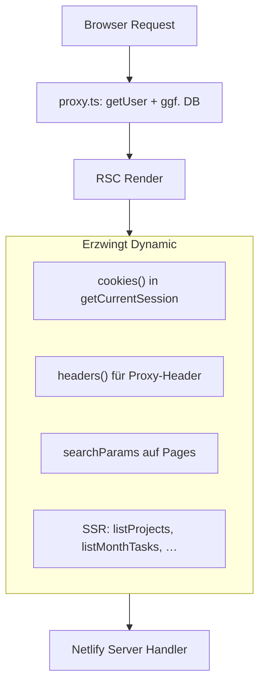

# Netlify Compute: Auth- und Rendering-Optimierung

## 1. Ist das wirklich so? — Ja, mit einer wichtigen Nuance

**Bestätigt:** Jeder Aufruf von `cookies()` oder `headers()` in einer Server Component markiert die Route als **dynamisch** (Build-Symbol `ƒ`). Das ist Next.js-Standardverhalten, nicht ein Netlify-Bug.

**Nuance:** Eine eingeloggte Field-Service-App wird **nicht** zu «statischen HTML-Seiten» werden, solange Layout/Seiten personalisierte Daten brauchen. Realistisches Ziel auf Netlify:

- **Weniger Arbeit pro Serverless-Invocation** (Auth, DB, doppelte Session)
- **Echte Static-Routen** nur für öffentliche Shells (`/anmeldung`, `/onboarding`, Assets)
- Geschützte Bereiche bleiben `ƒ`, werden aber **deutlich leichter**

---

## 2. Inventar: `getCurrentSession()` — alle Aufrufe

### Layouts (höchster Impact — jede Kind-Route)

| Datei | Effekt |
|-------|--------|
| [`app/(app)/layout.tsx`](app/(app)/layout.tsx) | **Alle Büro-Routen** dynamic + `getOrganizationBranding` + `isAdminMfaRequiredAndMissing` |
| [`app/(tech)/layout.tsx`](app/(tech)/layout.tsx) | **Alle Tech-Routen** dynamic |

[`app/layout.tsx`](app/layout.tsx) — **kein** `getCurrentSession` (gut: QueryProvider/SSE nur Client).

### Pages mit redundanter Session (Layout hat bereits Session; `cache()` dedupliziert nur **pro Request**)

| Datei | Zusätzliche SSR-Last |
|-------|----------------------|
| [`app/(app)/projekte/page.tsx`](app/(app)/projekte/page.tsx) | Session + `listProjectsForOffice` + `listAssignableProfiles` |
| [`app/(app)/kalender/page.tsx`](app/(app)/kalender/page.tsx) | Session + `listMonthTasks` |
| [`app/(app)/mitarbeiter/page.tsx`](app/(app)/mitarbeiter/page.tsx) | Session + `listTeamMembersAction` + Absences |
| [`app/(app)/einstellungen/page.tsx`](app/(app)/einstellungen/page.tsx) | Session + Profile + Org-Query |
| [`app/(app)/bestellformulare/page.tsx`](app/(app)/bestellformulare/page.tsx) | Session |
| [`app/(tech)/tag/page.tsx`](app/(tech)/tag/page.tsx) | Session + `listWeekTasks` |
| [`app/(tech)/wochenplan/page.tsx`](app/(tech)/wochenplan/page.tsx) | Session + `listWeekTasks` |
| [`app/(tech)/profil/page.tsx`](app/(tech)/profil/page.tsx) | Session |
| [`app/(tech)/auftrag/[projectId]/page.tsx`](app/(tech)/auftrag/[projectId]/page.tsx) | Session + `getProjectCore` + Storage-Signing |
| [`app/(auth)/mfa/setup/page.tsx`](app/(auth)/mfa/setup/page.tsx) | Session (kein App-Layout, aber `cookies()`) |

### Pages ohne `getCurrentSession` (leichter — aber Proxy läuft trotzdem)

| Datei | Status |
|-------|--------|
| [`app/(auth)/anmeldung/page.tsx`](app/(auth)/anmeldung/page.tsx) | Reine UI — **könnte static werden** |
| [`app/(auth)/onboarding/page.tsx`](app/(auth)/onboarding/page.tsx) | Reine UI — **könnte static werden** |
| [`app/(app)/page.tsx`](app/(app)/page.tsx) | Nur `redirect` — unter App-Layout trotzdem dynamic |

### Server Actions / API (Compute bei POST, nicht bei Page-View)

~40+ Aufrufe in [`app/(app)/projekte/actions.ts`](app/(app)/projekte/actions.ts), [`app/(app)/actions.ts`](app/(app)/actions.ts), [`app/(app)/einstellungen/actions.ts`](app/(app)/einstellungen/actions.ts), [`app/(tech)/*`](app/(tech)/), [`app/api/events/route.ts`](app/api/events/route.ts) (`force-dynamic`).

**Diese bleiben** — Security-Grenze für Mutationen und SSE.

### Hilfsketten

- [`lib/auth/organization.ts`](lib/auth/organization.ts) → `getCurrentSession`
- [`lib/auth/mfa.ts`](lib/auth/mfa.ts) → `getCurrentSession` **nochmals** im App-Layout (via `cache()` dedupliziert, aber MFA-API extra)

---

## 3. `cookies()` / Supabase Server — wo

| Ort | Verwendung |
|-----|------------|
| [`lib/auth/session.ts`](lib/auth/session.ts) | `cookies()` + `headers()` + `createSupabaseServerClient` + Membership/Profile-DB |
| [`lib/supabase/server.ts`](lib/supabase/server.ts) | `cookies()` für jeden Repo-/Action-Call |
| [`proxy.ts`](proxy.ts) | `request.cookies` (Edge/Proxy — **zählt nicht** als RSC-dynamic, aber Netlify Compute) |

[`lib/db/repository.ts`](lib/db/repository.ts) — 25+ `createSupabaseServerClient()`-Aufrufe (jeder SSR-Datenpfad).

---

## 4. Proxy-Analyse

[`proxy.ts`](proxy.ts) Matcher: `"/((?!_next/static|_next/image|favicon.ico).*)"` — **sehr breit**.

**Teure Operationen pro Request:**

| Operation | Wann | Problem |
|-----------|------|---------|
| `supabase.auth.getUser()` | Fast **jeder** Request inkl. `/anmeldung` | Auth-API auch ohne Login-Cookie |
| DB `organization_memberships` | Nur `GET /` | OK, selten |
| Techniker-Route-Guard | Geschützte Pfade | OK |

**Lücke:** `isStaticAsset` prüft `pathname.includes(".")` **innerhalb** der Proxy-Funktion — Matcher feuert trotzdem (z. B. `/manifest.webmanifest`, `/icons/*`).

Prio-1-Optimierung (`getSession` via Proxy-Header in RSC) **reduziert Auth-API in RSC**, ändert aber **nicht** das Dynamic-Flag.

---

## 5. Was erzwingt Dynamic — und was kann weg

### Muss dynamic bleiben (Security + Personalisierung)

- Alle `(app)/*` und `(tech)/*` mit Auth — **aber Compute kann sinken**
- Server Actions, `/api/events`
- `/auftrag/[projectId]` (projektspezifische SSR-Daten sinnvoll für First Paint)

### Kann leichter werden (Haupthebel)

| Hebel | Einsparung | Risiko |
|-------|------------|--------|
| Proxy: Public Routes ohne `getUser()` | Auth-API auf Login/Onboarding | Niedrig — Proxy blockt geschützte Routen weiter |
| Proxy-Matcher erweitern | Weniger Proxy-Invocations | Niedrig |
| Layout: Branding client-seitig | 1 DB-Query pro Navigation | Niedrig |
| Layout: MFA nur für Admin-Pfade prüfen | MFA-API auf Nicht-Admin-Seiten | Niedrig |
| Pages: SSR-Daten → Client React Query | Grösster DB-Compute-Win | Mittel — Loading-State, SSR weiterhin für Shell |
| `getLayoutContext()` aus Proxy-Headers | Weniger Membership-Queries in RSC | Mittel — sorgfältige Header-Security |

### Kann static werden (nach Proxy-Fix)

- [`app/(auth)/anmeldung/page.tsx`](app/(auth)/anmeldung/page.tsx)
- [`app/(auth)/onboarding/page.tsx`](app/(auth)/onboarding/page.tsx)

---

## 6. Konkreter Refactor-Plan (3 Phasen, Security-first)

### Phase A — Quick Wins (kein UX-Bruch, ~30–50% weniger Proxy/RSC-Auth)

**A1. Proxy: Public fast-path**

In [`proxy.ts`](proxy.ts):

- Für `PUBLIC_PATHS` (`/anmeldung`, `/onboarding`, `/mfa/setup`): **kein** `getUser()`, wenn kein `sb-*-auth-token`-Cookie
- Mit Cookie (eingeloggt auf `/anmeldung`): weiterhin `getUser()` + Redirect

**A2. Proxy-Matcher enger**

Matcher ergänzen um: `manifest.webmanifest`, `icons`, gängige Static-Extensions — weniger Function-Starts.

**A3. Proxy-Header erweitern** ([`lib/auth/proxy-auth-headers.ts`](lib/auth/proxy-auth-headers.ts))

Nach `getUser()` einmalig (optional gecacht pro Request):

- `x-bauflip-proxy-auth-user-id` (existiert)
- **neu:** `x-bauflip-proxy-role`, `x-bauflip-proxy-org-id` aus `organization_memberships` (nur wenn authentifiziert)

**A4. `getLayoutSession()` — schlankes Layout-API**

Neue Funktion in [`lib/auth/session.ts`](lib/auth/session.ts):

- Liest Proxy-Header + `getSession()` (Cookie, kein Auth-API)
- Liefert `{ userId, role, organizationId }` für Layout-Guards
- **Kein** Profile-Upsert, **keine** Membership-DB in Layout

Volles `getCurrentSession()` nur wo Profile/Org wirklich gebraucht wird (Actions, Sheet, Profil).

**A5. App/Tech Layouts umstellen**

- [`app/(app)/layout.tsx`](app/(app)/layout.tsx): `getLayoutSession()` statt `getCurrentSession()`
- [`app/(tech)/layout.tsx`](app/(tech)/layout.tsx): idem
- Branding → kleine Client-Komponente `OrganizationBrandingHeader` mit React Query / leichtem Server Action (einmal pro Session)
- MFA-Check: nur wenn `role === 'admin'` (nicht bei jedem Office-User)

### Phase B — Page Shells (grösster Netlify-Compute-Win)

Ziel: SSR rendert **nur Shell + Loading**, Daten via bestehende Hooks.

| Route | Heute SSR | Nachher |
|-------|-----------|---------|
| `/projekte` | `listProjectsForOffice` + Technicians | `useProjectsList()` ohne `initialData` (oder leeres Skeleton) |
| `/kalender` | `listMonthTasks` | `useCalendarRangeTasks` / `fetchMonthTasksAction` client-first |
| `/tag`, `/wochenplan` | `listWeekTasks` | `useWeekTasks` client-first |
| `/mitarbeiter` | Team + Absences SSR | Client fetch via Actions |

Pages entfernen redundantes `getCurrentSession()` — Layout-Guard reicht.

**Sicherheit:** Proxy + Server Actions behalten volle Auth; nur **Read-SSR** wandert zum Client.

### Phase C — Verifikation

- `npm run build` — Route-Tabelle dokumentieren (vorher/nachher)
- Erwartung: `(auth)/anmeldung` → `○` Static; `(app)/*` bleibt `ƒ`, aber kürzere Function-Dauer
- Manuell: Login, Monteur-Guard, Admin-MFA, `/projekte` Daten, Cross-Tab SSE

---

## 7. Was wir bewusst NICHT tun

- Kein Entfernen von Proxy-Auth auf geschützten Routen
- Kein Client-only Session für Server Actions
- Kein `force-static` auf `(app)`/`(tech)` — würde Security brechen
- Kein Entfernen von `getCurrentSession` aus Actions

---

## 8. Erwarteter Impact

| Massnahme | Proxy Compute | RSC Compute |
|-----------|---------------|-------------|
| Public fast-path | Hoch auf `/anmeldung` | — |
| Matcher | Mittel | — |
| Layout slim + Branding client | — | Hoch (jede Navigation) |
| Client data pages | — | Sehr hoch (`/projekte`, `/kalender`, `/tag`) |

**Wichtig:** Build wird weiter «fast alles dynamic» zeigen für App-Bereiche — das ist OK. Netlify-Rechnung sinkt durch **kürzere** Functions, nicht durch mehr `○ Static`.
