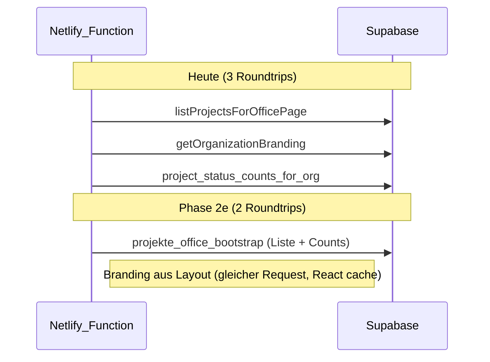

# Phase 2e — Server/DB ohne UI-Change

## Ausgangslage (Prod-HAR)

| Metrik | Aktuell | Engpass |
|--------|---------|---------|
| Data ready | ~816 ms | stabil |
| TTFB | ~351 ms | **3 parallele Supabase-Calls** beim Page-Load |
| RSC gesamt | ~324 KB | davon nur ~13 KB TanStack-JSON; ~287 KB pre-rendered HTML |
| Dehydrated JSON | ~13 KB | bereits optimiert (2b/2d) |

Weiteres JSON-Slimming bringt fast nichts. **TTFB** ist der Hebel — Ziel: **~280–320 ms** (−30–70 ms).



---

## 1. Bootstrap-RPC — Liste + Counts in 1 Roundtrip

**Migration:** neue Datei z.B. [`supabase/migrations/20260626120000_perf_projekte_office_bootstrap_rpc.sql`](supabase/migrations/20260626120000_perf_projekte_office_bootstrap_rpc.sql)

**Funktion:** `public.projekte_office_bootstrap(p_org_id uuid, p_filter text, p_search text, p_limit int default 50)`

- **`security invoker`**, `stable`, `search_path = public` — RLS bleibt aktiv wie bei bestehenden RPCs ([`20260622190000_perf_status_counts_search_trgm.sql`](supabase/migrations/20260622190000_perf_status_counts_search_trgm.sql))
- **Status-Counts:** gleiche Aggregation wie `project_status_counts_for_org` (inline, kein Breaking Change am bestehenden RPC)
- **Liste Seite 1:** Spalten wie heute `PROJECT_LIST_COLUMNS` — `id, title, type, status, tenant_name, created_at`
- **Filter-Logik** (Spiegel von [`listProjectsForOfficePage`](lib/db/repository.ts)):
  - `active` → `status <> 'abgeschlossen'`
  - `all` → offene zuerst (Segment `open`, kein Cursor bei Bootstrap)
  - einzelner Status → `status = p_filter`
  - Suche → `ilike` auf title, tenant_name, service_*, reference_code (nutzt bestehende trgm-Indexes)
- **Paging:** `limit + 1` für `hasMore`; Keyset-Cursor nur für «Mehr laden» — **nicht** im Bootstrap-RPC (Seite 1 hat immer `cursor = null`)
- **Return:** `jsonb` mit `{ statusCounts: { byStatus, totalAll, totalActive }, projects: [...], hasMore, lastCreatedAt, lastId }`

**Ausnahme (bestätigt):** Filter **`abgemacht`** bleibt beim bestehenden TypeScript-Pfad (`listProjectsForOfficePage` + `listProjectStatusCountsForOffice` parallel) — Termin-Sortierung und Offset-Paging nicht in SQL duplizieren.

**Repository:** neue Funktion `loadProjekteBootstrapViaRpc(...)` in [`lib/db/repository.ts`](lib/db/repository.ts)

- Mappt JSON → bestehende Typen `ProjekteListPageResult` + `ProjekteStatusCountsSnapshot`
- `mapProjectListRow` wiederverwenden (tenant_name → title wie heute)
- `nextCursor` weiter in TS encodieren via [`encodeProjekteListCursor`](lib/projekte/list-page.ts)
- Bei RPC-Fehler: **Fallback** auf heutiges `Promise.all([listProjectsForOfficePage, listProjectStatusCountsForOffice])` — kein Datenverlust

**Bootstrap-Loader:** [`lib/projekte/server-bootstrap.ts`](lib/projekte/server-bootstrap.ts)

```typescript
// Vorher: Promise.all([page, branding, counts])
// Nachher:  branding aus Layout (s. 2); page+counts via RPC (oder Fallback)
```

**Verifikation:** [`scripts/perf/verify-projekte-bootstrap-rpc.sql`](scripts/perf/verify-projekte-bootstrap-rpc.sql) + Ergänzung in [`scripts/perf/explain-top-queries.sql`](scripts/perf/explain-top-queries.sql)

---

## 2. Branding im App-Layout (1 Query weniger auf `/projekte`)

Heute lädt nur [`loadProjekteBootstrapData`](lib/projekte/server-bootstrap.ts) Branding; der Header auf `/projekte` skippt den Client-Fetch ([`organization-branding-header.tsx`](components/app/organization-branding-header.tsx)).

**Änderungen:**

| Datei | Änderung |
|-------|----------|
| [`app/(app)/layout.tsx`](app/(app)/layout.tsx) | `getOrganizationBranding(session.organizationId)` aufrufen (bereits `cache()` in Repository) |
| Neues `components/app/organization-branding-provider.tsx` | Context wie [`session-profile-provider.tsx`](components/app/session-profile-provider.tsx) |
| [`organization-branding-header.tsx`](components/app/organization-branding-header.tsx) | Context-Wert nutzen; `/projekte`-Sonderfall entfernen |
| [`lib/projekte/server-bootstrap.ts`](lib/projekte/server-bootstrap.ts) | Branding-Fetch entfernen |
| [`lib/projekte/bootstrap-types.ts`](lib/projekte/bootstrap-types.ts) | `branding` aus `ProjekteBootstrapData` entfernen (Actions/Hooks anpassen) |
| [`lib/query/projekt-bootstrap-cache.ts`](lib/query/projekt-bootstrap-cache.ts) | `setQueryData(organizationBranding)` entfernen — Layout liefert Header-Daten |
| [`lib/query/hooks.ts`](lib/query/hooks.ts) | `useOrganizationBranding`: optional `initialData` aus Context für Einstellungen |

**Verhalten unverändert:** Header zeigt weiter Name + Logo; nach Speichern in Einstellungen aktualisiert Server-Action + Navigation wie heute.

**Dehydration:** `/projekte` hat künftig **2 statt 3** TanStack-Queries (~1 KB weniger JSON — marginal, aber sauberer).

---

## 3. Partial Index — Default-Filter «aktiv»

**Migration** (gleiche oder separate Datei):

```sql
create index if not exists idx_projects_org_created_active
  on public.projects (organization_id, created_at desc, id desc)
  where status <> 'abgeschlossen';
```

Ergänzt bestehenden [`idx_projects_org_created_at`](supabase/migrations/20260407090704_perf_core_indexes.sql) — Postgres wählt Partial Index für den häufigsten Pfad (`active`, ~82 von 241 Projekten bei Gross Storenbau).

Kein Code-Change nötig; Query in Repository bleibt identisch.

---

## 4. Infra-Hinweis (Doku only, kein Code-Zwang)

In [`.env.example`](.env.example) kurz ergänzen:

- Supabase **Connection Pooler** (Transaction Mode, Port 6543) für Serverless/Netlify
- Region-Abgleich Netlify Functions ↔ Supabase (`eu-central-2`)

Kein neues Secret zwingend — nur Betriebshinweis.

---

## Explizit nicht im Scope

| Vorschlag | Grund |
|-----------|-------|
| RSC Streaming | Receive (~461 ms) kommt vom HTML-Chunk (~287 KB); Streaming ändert Architektur spürbar |
| `unstable_cache` für Counts | Dropdown-Zähler könnten kurz veralten; Realtime-Invalidierung komplexer |
| Weitere JSON-Felder streichen | JSON ist nur ~4 % des RSC-Payloads |
| UI/HTML schlanker rendern | wäre sichtbare UX-/Markup-Änderung |

---

## Erwartetes Ergebnis nach Deploy

| Metrik | Vorher | Ziel |
|--------|--------|------|
| Supabase Roundtrips `/projekte` | 3 | **2** (Bootstrap-RPC + Layout-Branding teilt Request) |
| TTFB | ~351 ms | **~280–320 ms** |
| Data ready (warm) | ~816 ms | **~730–780 ms** |
| RSC gesamt | ~324 KB | ~320 KB (minimal) |
| UI/UX | — | **identisch** |
| Daten | 50 Zeilen, alle Counts, Suche, Filter | **vollständig** |

**Messung nach Deploy:**

```bash
node scripts/perf/summarize-har.mjs ~/Desktop/app.gross-storenbau.ch.har
```

Checkliste: Default `/projekte`, `?status=all`, `?q=...`, `?status=abgemacht`, «Mehr laden», Realtime-Mutation → Counts/Liste invalidieren.

---

## Implementierungsreihenfolge

1. Partial Index (risikoarm, sofort wirksam nach Migration)
2. Layout-Branding (kleine, isolierte Änderung)
3. Bootstrap-RPC + Repository-Fallback + Verifikations-Skript
4. Docs: [`docs/performance-production-har.md`](docs/performance-production-har.md) Phase-2e-Abschnitt
