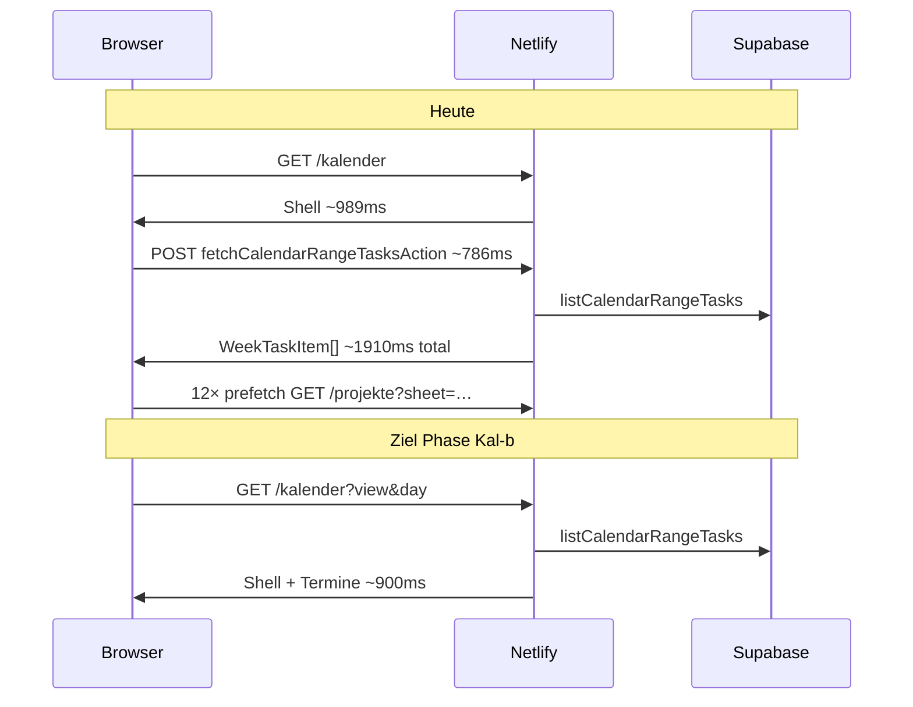

# Phase Kal — Kalender Hybrid-SSR (Bewertung, kein Code)

## Ausgangslage (Prod-HAR `/kalender`)

| Metrik | Wert | Problem |
|--------|------|---------|
| `GET /kalender` | ~989 ms | Shell-only RSC (~42 KB) |
| `POST /kalender` | ~786 ms | Termine **nach** Hydration |
| **Data ready (Termine)** | **~1910 ms** | Waterfall |
| Hintergrund | **12×** `GET /projekte?sheet=…` | Next.js **Link-Prefetch** |
| `/projekte` zum Vergleich | ~821 ms data ready | Hybrid-SSR bereits optimiert |



---

## Ist die Idee sinnvoll?

**Ja — für den Baustellen-Use-Case (Call, schnell Termin → Projekt) sogar wichtiger als weiteres `/projekte`-Tuning.**

Gründe:

- Kalender ist **zweiter Haupt-Einstieg** neben Projekte-Liste
- Aktuell **langsamer bis Daten da** als `/projekte` (~1,9 s vs. ~0,8 s)
- Code hat **Prefetch-Hook vorbereitet**, nutzt ihn aber nicht: `KalenderPageClient` übergibt `initialTasks={[]}`; `AdminCalendar` (Zeilen 433–438) kann Cache primen, bekommt aber nie SSR-Daten
- `app/(app)/kalender/page.tsx` ist reine Client-Shell — Gegenteil von `app/(app)/projekte/page.tsx`

---

## Phase Kal-a — Quick Win: Prefetch abschalten (sofort, klein)

**Problem:** `AppointmentCard` in `admin-calendar.tsx` nutzt `<Link href={buildProjekteSheetHref(...)}>` ohne `prefetch={false}`. Next prefetched die **gesamte `/projekte`-RSC-Route** pro sichtbarer Termin-Karte.

**Änderung:** `prefetch={false}` auf Kalender-Links zu `/projekte?sheet=…` (auch `calendar-availability-rail.tsx` falls betroffen).

| | |
|--|--|
| **Payload/TTFB Kalender** | kaum |
| **Hintergrund-Compute** | **−12 Function-Calls** pro Kalender-Load |
| **Spürbares UX** | weniger Jank, schnellerer POST |
| **Aufwand** | **klein** (~1 h) |
| **Risiko** | **niedrig** — Klick etwas langsamer ohne Hover-Prefetch (kompensierbar in Kal-c) |

**Empfehlung:** unabhängig von Hybrid-SSR **sofort** umsetzbar.

---

## Phase Kal-b — Hybrid-SSR für initialen Zeitraum (Kern)

**Vorbild:** `buildProjekteDehydratedState` + `ProjekteHydrationBoundary`

### Server-Seite

Neue Dateien (Vorschlag):

- `lib/kalender/server-bootstrap.ts` — lädt `listCalendarRangeTasks(startIso, endIso)` für URL-Zustand
- `lib/kalender/calendar-range.ts` — **shared** Range-Berechnung aus URL (extrahiert aus `AdminCalendar` useMemo, damit Server/Client identisch)
- `components/app/kalender-hydration-boundary.tsx` — TanStack `HydrationBoundary`

`app/(app)/kalender/page.tsx` wird async RSC:

1. Session/Org wie Projekte
2. `searchParams` → `parseAdminCalendarUrlState` (`lib/navigation/admin-calendar-navigation.ts`)
3. Range `startIso`/`endIso` berechnen (Default: **Tag-Ansicht**, heute Europe/Zurich)
4. `listCalendarRangeTasks` (org-scoped via RLS) — existiert in `lib/db/repository.ts`
5. `dehydrate` Query-Key `queryKeys.calendarRange.byStartEnd(start, end)`

### Client-Seite

- `KalenderPageClient`: `initialTasks` aus Dehydration statt `[]`
- `useCalendarRangeTasks`: `refetchOnMount: false`, `staleTime` wie heute (90 s) — View-Wechsel weiter per POST

### View-Modi

| Modus | SSR beim ersten Load? | Nach Navigation |
|-------|----------------------|---------------|
| **day** (Default) | **Ja** — 1 Tag, klein | POST bei Tag-Wechsel |
| week | Optional Phase Kal-b2 | POST |
| month | Später / lazy | POST (mehr Zeilen) |
| year | **Nein** SSR initial | POST |
| availability | Separater Pfad (`fetchAvailabilityRangeAction`) | Phase Kal-d |

**MVP-Scope Kal-b:** nur **Default-URL** `/kalender` und `/kalender?day=YYYY-MM-DD` (Tag-Ansicht). Das deckt ~80 % der HAR und typischen Morgen-Check ab.

### Erwartete Metrik (Tag-Ansicht, warm)

| Metrik | Heute | Ziel Kal-b |
|--------|-------|------------|
| POST initial | 1× ~786 ms | **0×** |
| Data ready Termine | ~1910 ms | **~900–1100 ms** |
| RSC Payload | ~42 KB Shell | ~55–80 KB (+ Termine JSON/HTML) |
| TTFB | ~567 ms | ~350–450 ms (1 DB-Roundtrip statt 2 Hops) |

---

## Phase Kal-c — Kalender → Projekt schneller (Call-Flow)

**Problem heute:** Klick navigiert zu `/projekte?sheet=id` → voller Projekte-SSR (~800 ms) + `getProjectCore` (~300–800 ms).

**Option A (klein):** Beim Klick nur navigieren; Prefetch bleibt aus (Kal-a). Sheet lädt wie heute.

**Option B (mittel, empfohlen):** `onMouseEnter` / `onFocus` auf Termin-Karte → **`getProjectSheetDataAction(projectId)`** in TanStack cache (`queryKeys.projects.core`) — **ohne** `/projekte`-RSC-Prefetch.

**Option C (grösser):** Kalender-Sheet inline (Modal) statt Route-Wechsel — **UI-Change**, nicht empfohlen als erste Phase.

| Option | Sheet-Zeit nach Klick | Aufwand | UI |
|--------|----------------------|---------|-----|
| A | ~800 ms + Core | — | gleich |
| B | **~200–400 ms** Stammdaten-Ziel | mittel | gleich |
| C | schnellste | gross | **ändert Flow** |

**Empfehlung:** Kal-a + Kal-b zuerst; **Kal-c Option B** als zweite Welle (synergisch mit geplantem Sheet-Section-Loading / Phase 2f).

---

## Phase Kal-d — Verfügbarkeits-Ansicht (optional)

`CalendarAvailabilityRail` nutzt `fetchAvailabilityRangeAction` (Termine + Abwesenheiten + Monteure). Nur relevant wenn `?view=availability` häufig genutzt wird.

**Defer** bis Kal-b live + Nutzungsfeedback.

---

## Was bewusst nicht tun

| Vorschlag | Warum nicht |
|-----------|-------------|
| Alle View-Modi (year) SSR | Riesige Payloads, wenig ROI |
| Kalender-Daten in Layout SSR | Nur `/kalender` betroffen |
| DB-Wechsel | Engpass ist Architektur, nicht Postgres |
| `prefetch={true}` beibehalten | HAR zeigt messbaren Schaden |

---

## Betroffene Dateien (Übersicht)

| Bereich | Dateien |
|---------|---------|
| Page SSR | `app/(app)/kalender/page.tsx` |
| Bootstrap | neu: `lib/kalender/server-bootstrap.ts`, `lib/kalender/calendar-range.ts` |
| Hydration | neu: `components/app/kalender-hydration-boundary.tsx` |
| Client | `kalender-page-client.tsx`, `admin-calendar.tsx` |
| Hooks/Keys | `lib/query/hooks.ts`, `lib/query/keys.ts` |
| Prefetch | `admin-calendar.tsx`, `calendar-availability-rail.tsx` |
| DB | `listCalendarRangeTasks` in `lib/db/repository.ts` — unverändert oder Index-Check |
| Realtime | `lib/query/invalidations.ts` — bereits `calendarRange.all()` |
| Docs/HAR | `docs/performance-production-har.md`, `scripts/perf/summarize-har.mjs` um `/kalender` erweitern |

---

## Realtime & Invalidierung

Bereits vorhanden: Appointment-Mutationen invalidieren `queryKeys.calendarRange.all()`. Hybrid-SSR ändert daran nichts — Client refetched nach Realtime wie heute.

---

## Implementierungsreihenfolge

```
Kal-a  prefetch={false}           (~1 h,   Risiko niedrig)
Kal-b  Hybrid-SSR Tag-Ansicht     (~1–2 T, Risiko mittel)
       HAR vergleichen
Kal-c  Hover-Prefetch ProjectCore (~0,5–1 T, optional)
Kal-d  availability SSR           (optional, später)
```

---

## Erfolgskriterien (HAR)

Nach Kal-a + Kal-b, gleiche Aufnahme (Incognito, Filter `gross-storenbau`, 2. Reload):

- `POST /kalender` beim **ersten** Tag-Load: **0**
- Termine im Document oder dehydrated JSON sichtbar
- **Keine** massenhaften `GET /projekte?sheet=` im Hintergrund
- Data ready **< 1100 ms** (Ziel: nah an `/projekte` ~800 ms)
- Funktion: Tag wechseln, Woche/Monat, Klick → Projekt-Sheet, Realtime-Terminänderung

```bash
node scripts/perf/summarize-har.mjs ~/Desktop/app.gross-storenbau.ch.har
# ggf. Script um /kalender-Metriken erweitern
```

---

## Gesamtbewertung

| Kriterium | Bewertung |
|-----------|-----------|
| Sinnvoll für Bauflip? | **Ja, hoch** |
| Besser als nur Pagination? | **Orthogonal** — Kalender hat kein Pagination-Problem |
| Netlify-Kosten | **Senkung** (−POST, −12 Prefetches) |
| Aufwand MVP (Kal-a+b) | **klein + mittel** |
| Risiko MVP | **niedrig–mittel** |
| Grösster Nutzen | **Call-Szenario:** Termine ~2× schneller sichtbar |

**Fazit:** Kalender nachziehen auf dasselbe Hybrid-SSR-Muster wie `/projekte` ist die **logische nächste Performance-Phase** — mit **grösserem spürbarem Effekt** als weiteres Host- oder DB-Tuning.
