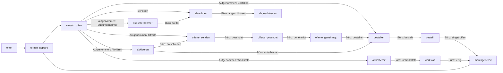

# Workflow Status Ausbau

## Workflow-Übersicht



## Dateien und Änderungen

### 1. DB-Migration — neuer Status-Check

Neue Datei `supabase/migrations/20260410000000_expand_project_statuses.sql`:

```sql
alter table public.projects
  drop constraint if exists projects_status_check;

alter table public.projects
  add constraint projects_status_check check (
    status in (
      'offen','termin_geplant','einsatz_offen',
      'offerte_senden','offerte_gesendet','offerte_genehmigt',
      'bestellen','bestellt','montagebereit',
      'abholbereit','werkstatt',
      'abklaeren','abrechnen','subunternehmer',
      'abgeschlossen'
    )
  );
```

### 2. [`lib/domain/types.ts`](lib/domain/types.ts)

- `projectStatuses` Array auf alle 15 Werte erweitern
- `projectStatusLabels` mit deutschen Labels (z. B. `offerte_senden: "Offerte senden"`)
- Neue Konstante `RAPPORT_NEXT_STEPS`: welche Status der Monteur nach Rapport wählen darf — gebraucht im Formular und in der Validierung

```typescript
export const RAPPORT_NEXT_STEPS_AUFGENOMMEN = [
  "offerte_senden",
  "bestellen",
  "abklaeren",
  "abholbereit",
  "subunternehmer",
] as const satisfies readonly ProjectStatus[];

export const RAPPORT_NEXT_STEP_BEHOBEN = "abrechnen" satisfies ProjectStatus;
```

### 3. [`lib/validations/forms.ts`](lib/validations/forms.ts)

- `technicianReportSchema`: Neues Feld `nextStatus: z.enum(RAPPORT_NEXT_STEPS_AUFGENOMMEN).optional()` (pflicht wenn `outcome === "schaden_aufgenommen"`, aus dem Formular gesteuert)
- `projectStammdatenUpdateSchema`: Automatisch korrekt, da `z.enum(projectStatuses)` — keine Änderung nötig

### 4. [`lib/db/repository.ts`](lib/db/repository.ts) — `addTechnicianReport`

- Signatur erweitern: `input` bekommt `nextStatus?: ProjectStatus`
- Status-Logik: 
  - Wenn `outcome === "schaden_behoben"` → Status `abrechnen` (statt `abgeschlossen`)
  - Wenn `outcome === "schaden_aufgenommen"` → Status = `nextStatus` (aus Formular)
  - Fallback: `einsatz_offen` wenn nichts übergeben (Rückwärtskompatibilität)

### 5. [`app/(tech)/actions.ts`](app/(tech)/actions.ts) — `submitTechnicianReportAction`

- `nextStatus` aus dem validierten Input an `addTechnicianReport` weitergeben

### 6. [`components/app/monteur-auftrag-client.tsx`](components/app/monteur-auftrag-client.tsx)

**a) Status-Banner oben (neu)**
- Prominente Anzeige des aktuellen Status direkt nach dem Header-Card
- Farbiges Badge + label + kurze Kontextbeschreibung ("Was als nächstes?", "Warte auf Büro", etc.)

**b) "Nächster Schritt" im Rapport-Formular**
- Nur wenn `mode === "schaden_aufgenommen"`: Pflichtfeld, Card-Grid mit Optionen
- Optionen: Offerte senden / Material bestellen / Abklärungen / Werkstatt / Subunternehmer
- Jede Option hat Icon + Label + kurze Erklärung (wie die bestehenden Einsatz-Cards)
- `nextStatus` wird beim Absenden mitgegeben

```
[ Behoben ]           → Rapport → auto-weiter zu "Abrechnen"
[ Aufgenommen ] → + Nächster Schritt wählen (Pflicht)
```

### 7. [`components/app/projekt-sheet-editor.tsx`](components/app/projekt-sheet-editor.tsx)

**Status-Pipeline für Büro (neu)**

- Neuer Abschnitt oben im Sheet (nach Titel/Referenz)
- Zeigt aktuellen Status und kontextuelle "Weiter"-Buttons:

| Aktueller Status | Büro-Aktion(en) |
|---|---|
| `offerte_senden` | → "Offerte gesendet" |
| `offerte_gesendet` | → "Offerte genehmigt" |
| `offerte_genehmigt` | → "Material bestellen" |
| `bestellen` | → "Bestellt" |
| `bestellt` | → "Material eingetroffen" (→ `montagebereit`) |
| `montagebereit` | → (2. Termin planen via bestehenden Termin-Dialog) |
| `abholbereit` | → "In Werkstatt" |
| `werkstatt` | → "Werkstatt fertig" (→ `montagebereit`) |
| `abrechnen` | → "Abgeschlossen" |
| `abklaeren` | → "Offerte senden" oder "Bestellen" |
| `subunternehmer` | → "Abrechnen" |

Implementierung: Neues `updateProjectStatusAction(projectId, status)` in [`app/(app)/projekte/actions.ts`](app/(app)/projekte/actions.ts) (bereits existiert als unexported `updateProjectStatus` in repository) — klein, ein Server-Action-Aufruf, revalidate.

### 8. [`app/(tech)/tag/page.tsx`](app/(tech)/tag/page.tsx)

- Status-Badge in den Termin-Karten: Statt "Besichtigung"/"Ausführung" auch den Projekt-Status zeigen (kompakt, z. B. `projectStatusLabels[task.projectStatus]`)
- Monteur sieht auf der Übersicht sofort: "Offerte senden", "Montagebereit", usw.

## Was bleibt unverändert

- `appointments.kind` (besichtigung/ausfuehrung) — bestehende Terminarten bleiben
- RLS-Policies (keine neuen Spalten, nur Werte im Status-Check)
- Rapporte-Tabelle (`technician_reports`) — keine Schema-Änderung, nur `nextStatus` als App-Parameter
- `addAppointment` setzt weiterhin `termin_geplant` (passt, 2. Termin = gleicher Flow)
