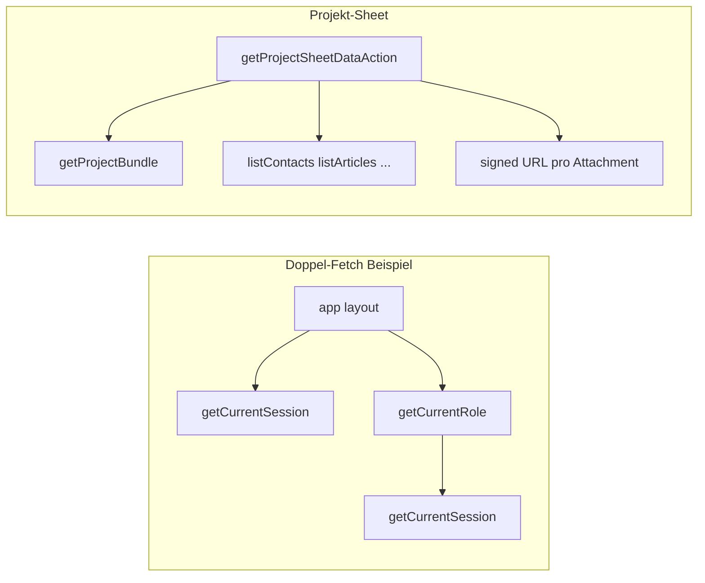

# Gründlicher Repo-Check: Security, Performance, DB, Allgemein

## Ausgangslage (bereits im Code sichtbar)

- **Kein [`middleware.ts`](middleware.ts)** im Root: zentrale Security-Header (CSP, HSTS prod), globale Auth-Weiterleitung und Rate-Limits laufen nicht auf Edge-Ebene.
- **[`next.config.ts`](next.config.ts)** ist praktisch leer — keine `headers()`, kein `experimental`-Tuning, keine Image-/Security-Defaults.
- **Doppelte Session-Auflösung:** [`getCurrentRole()`](lib/auth/session.ts) ruft intern `getCurrentSession()` auf. [`app/(app)/layout.tsx`](app/(app)/layout.tsx) ruft **beides** nacheinander auf → **zwei komplette** `getUser()` + RPC/Profil-Läufe pro App-Request. Gleiches Muster in [`app/api/export/[type]/route.ts`](app/api/export/[type]/route.ts) (`getCurrentSession` + `getCurrentRole`).
- **Schweres Projekt-Sheet:** [`getProjectSheetDataAction`](app/(app)/projekte/actions.ts) lädt bei jedem Öffnen `getProjectBundle` **plus** `listContacts`, `listSiteProperties`, `listProjectWorkTypes`, `listAssignableProfiles`, `listSupplierTemplates`, `listArticles`, Outcome/Select-Optionen **und** pro Attachment einen Signed-URL-Aufruf (`Promise.all` über alle Anhänge). Referenzdaten sind org-weit und ändern sich selten — Kandidat für **Caching / Aufteilung**.
- **Client-Refetch:** [`components/app/projekt-sheet-editor.tsx`](components/app/projekt-sheet-editor.tsx) ruft `getProjectSheetDataAction` an mehreren Stellen erneut auf (u. a. nach Mutationen) — vollständiger Payload jedes Mal; Abgleich mit gezieltem `revalidatePath` + optimistisch oder **partiellem** Refresh sinnvoll.
- **Mock-Auth in Prod:** [`getCurrentSession`](lib/auth/session.ts) erlaubt Cookie-`bauflip_mock_*`, wenn `NODE_ENV !== "production"` **oder** `ALLOW_MOCK_AUTH=true` — für Production-Härtung dokumentieren und sicherstellen, dass `ALLOW_MOCK_AUTH` in Live-Umgebungen **nie** gesetzt ist.
- **Monolith [`lib/db/repository.ts`](lib/db/repository.ts):** sehr grosse Datei (~3000+ Zeilen) — Wartbarkeit, Review-Risiko; spätere Aufteilung nach Domäne (projects, contacts, quotes, …) erleichtert Reviews und Tree-Shaking (indirekt).

---

## 1. Security (Ziel: sehr hohe Latte)

| Thema | Massnahme |
|--------|-----------|
| **Transport & Headers** | `middleware.ts` oder `next.config` `headers`: `Strict-Transport-Security` (prod), `X-Content-Type-Options`, `Referrer-Policy`, `Permissions-Policy`; CSP iterativ (start report-only), frame-ancestors. |
| **Auth-Konsistenz** | Alle `app/api/**/route.ts` auf ein Muster vereinheitlichen: eine Session-Abfrage, Rolle aus Session (kein zweiter `getCurrentRole`-Call). Gleiches im App-Layout: **nur** `getCurrentSession()`, Rolle aus `session.role`. |
| **RLS & Backend** | Supabase **Security Advisors** ausführen (fehlende Policies, `SECURITY DEFINER`-Views, etc.); kritische Tabellen manuell gegen Checkliste ([`.cursor/skills/supabase-postgres-best-practices`](.cursor/skills/supabase-postgres-best-practices) / interne Skill-Datei). |
| **Server Actions** | Stichprobe in [`app/(app)/actions.ts`](app/(app)/actions.ts): überall `organizationId`/Rolle prüfen, Eingaben über Zod; keine sensiblen Daten in Client-Fehlermeldungen. |
| **Webhooks** | [`app/api/integrations/zapier/bexio/route.ts`](app/api/integrations/zapier/bexio/route.ts): Signaturpflicht beibehalten; Rate-Limit / IP-Logging erwägen. |
| **Dateien / PDF** | Signed URLs und Storage-Pfade: Pfad-Validierung (`organizationId`-Prefix) wie bei [`removeStoredProjectPdf`](app/(app)/actions.ts); Upload-Grössen/MIME durchziehen. |
| **Abhängigkeiten** | `npm audit` / Dependabot; Major-Updates geplant (Next/React bereits sehr neu). |
| **Geheimnisse** | `.env` niemals committen; Turnstile/SMTP/Supabase-Service-Role nur Server-seitig. |

---

## 2. Performance (Ziel: spürbar 10/10 für UX)

| Priorität | Massnahme |
|-----------|-----------|
| **P0** | **Session deduplizieren:** Layout + Export-Route + alle Stellen mit `getCurrentRole` nach `getCurrentSession` bereinigen. Optional: `React.cache()` um [`getCurrentSession`](lib/auth/session.ts) in einem Request zu memoizen (Next/React 19 kompatibel prüfen). |
| **P0** | **Projekt-Sheet-Daten:** Referenzlisten (`contacts`, `articles`, `supplierTemplates`, …) mit `React.cache()` oder dedizierter „OrgSettings“-Server-Funktion cachen; Zapier-Flag (`organizations.zapier_enabled`) ggf. in Session/Profil-Context oder einmal pro Request cachen. Signed URLs: nur für sichtbare Anhänge oder Batch-Signierung mit kurzer TTL evaluieren. |
| **P1** | **Mutation → Refresh:** Statt überall vollständigem `getProjectSheetDataAction` gezieltere Updates (Server Action gibt minimales Delta zurück) oder `router.refresh()` mit schlankeren Server-Component-Daten. |
| **P1** | **Bundle:** `@next/bundle-analyzer` oder `next build` mit Analyse; schwere Client-Komponenten (PDF, Kalender) lazy wo möglich. |
| **P1** | **`revalidatePath`:** Audit auf zu breite Pfade (`/` + `/projekte` zusammen) — auf nötige Pfade eingrenzen wo sinnvoll. |
| **P2** | **`getProjectBundle`:** Postgres: zusammengefasste Views oder weniger Roundtrips nur wenn Advisors N+1 oder Latenz zeigen; aktuell bereits viel `Promise.all`. |

---

## 3. Datenbank

- **Supabase Performance Advisors** (fehlende Indizes auf FK-Filtern, `auth_rls_initplan`, etc.).
- **Schema-Review:** ungenutzte Spalten (z. B. alte `billing_*` auf `organizations` nach UI-Entfernung — optional `drop column` Migration).
- **Konsistenz:** Migrations-Reihenfolge, keine divergierenden lokalen DBs; `db:push:dry-run` in CI erwägen.
- **Backup & PITR:** Betrieblich klären (Supabase Plan).

---

## 4. Allgemein / Codequalität

- **Typecheck:** Bekannter Fehler in [`components/app/artikel-sheet-editor.tsx`](components/app/artikel-sheet-editor.tsx) (Resolver-Typen) — beheben, `tsc --noEmit` in CI.
- **Lint:** ESLint in CI; keine unbenutzten Imports/Exports (regelmässig).
- **Tote Abhängigkeiten:** `qrcode` wird noch von [`components/auth/mfa-setup-form.tsx`](components/auth/mfa-setup-form.tsx) genutzt — **behalten**.
- **Duplikat-Pfade:** Windows-Pfade `app\(app)\` vs `app/(app)/` im Repo — auf eine Schreibweise normalisieren (Git), um Review-Noise zu vermeiden.
- **Tests:** Minimal-Set (z. B. Vitest + Zod-Schemas + kritische `assertCanTransition`); später E2E für Login + ein Happy-Path.
- **Observability:** Strukturierte Logs für Server Actions bei Fehlern (ohne PII); optional Sentry später.

---

## Vorgehen (empfohlene Reihenfolge)

1. **Quick wins:** Session-Dedupe (Layout, Export, weitere grep-Treffer), `React.cache` für `getCurrentSession` falls kompatibel.
2. **Sheet-Payload:** Caching/Spaltung der Referenzdaten; Messung vor/nach (Lighthouse/TTFB oder einfach Log-Zeiten in dev).
3. **Security pass:** Middleware/Headers + Advisor-Liste abarbeiten.
4. **DB:** Advisors + gezielte Index-Migrationen.
5. **Hygiene:** `tsc` grün, Repo-Pfad-Normalisierung, Audit-Report dokumentieren (intern, keine neue MD-Datei ohne Bedarf).

---

## Erfolgskriterien (messbar)

- Pro typischem App-Request unter `(app)` **eine** vollständige Session-Auflösung (verifizierbar durch Logging oder React cache Hit-Rate in dev).
- `getProjectSheetDataAction`: deutlich weniger wiederholte Queries für unveränderte Referenzdaten pro Sheet-Öffnung.
- Supabase Security Advisor: keine kritischen offenen Punkte; Performance Advisor: keine „missing index“ auf häufigen Filtern ohne Begründung.
- `npm run build` + `tsc --noEmit` + `npm run lint` grün in CI.
